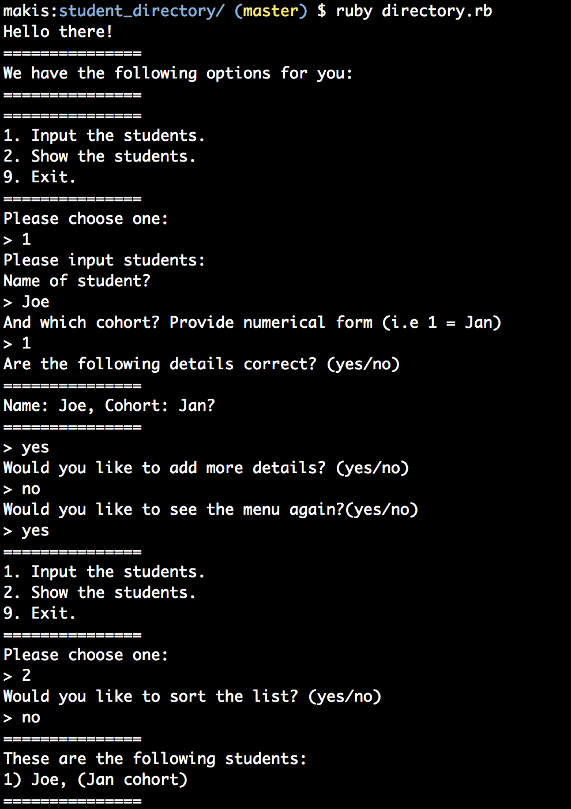

Student Directory
=================

The student directory script allows you to manage the list of students enrolled on the course at Makers Academy. Enjoy!

How to use
----------

Clone the repository with
```
git clone git@github.com:Maikon/student_directory.git
```
Switch to it with
```
cd student_directory
```
The run the following command:
```
ruby directory.rb
```
This is an example of the flow:


